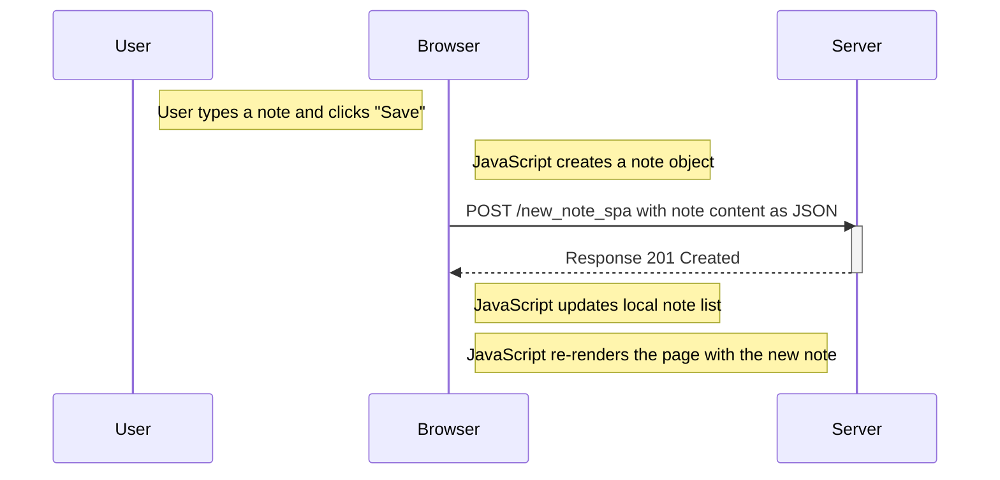

```mermaid
sequenceDiagram
    participant User
    participant Browser
    participant Server

    Note right of User: User types a note and clicks "Save"

    Note right of Browser: JavaScript creates a note object

    Browser->>Server: POST /new_note_spa with note content as JSON
    activate Server
    Server-->>Browser: Response 201 Created
    deactivate Server

    Note right of Browser: JavaScript updates local note list
    Note right of Browser: JavaScript re-renders the page with the new note
```
