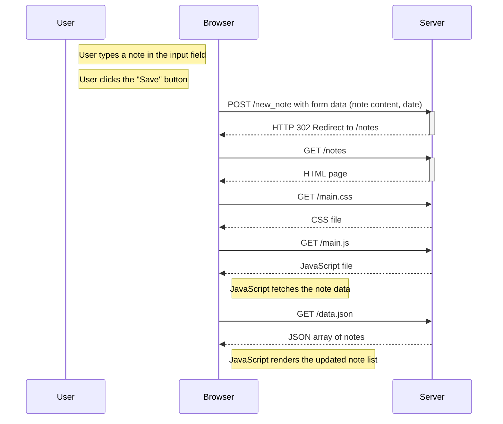

```mermaid
sequenceDiagram
    participant User
    participant Browser
    participant Server

    Note right of User: User types a note in the input field
    Note right of User: User clicks the "Save" button

    Browser->>Server: POST /new_note with form data (note content, date)
    activate Server
    Server-->>Browser: HTTP 302 Redirect to /notes
    deactivate Server

    Browser->>Server: GET /notes
    activate Server
    Server-->>Browser: HTML page
    deactivate Server

    Browser->>Server: GET /main.css
    Server-->>Browser: CSS file

    Browser->>Server: GET /main.js
    Server-->>Browser: JavaScript file

    Note right of Browser: JavaScript fetches the note data

    Browser->>Server: GET /data.json
    Server-->>Browser: JSON array of notes

    Note right of Browser: JavaScript renders the updated note list
```
