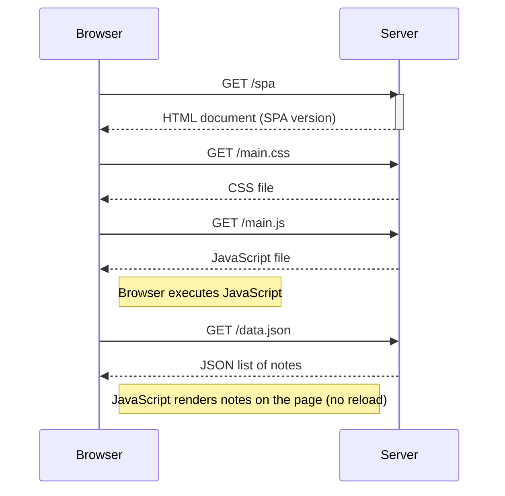

```mermaid
sequenceDiagram
    participant Browser
    participant Server

    Browser->>Server: GET /spa
    activate Server
    Server-->>Browser: HTML document (SPA version)
    deactivate Server

    Browser->>Server: GET /main.css
    Server-->>Browser: CSS file

    Browser->>Server: GET /main.js
    Server-->>Browser: JavaScript file

    Note right of Browser: Browser executes JavaScript

    Browser->>Server: GET /data.json
    Server-->>Browser: JSON list of notes

    Note right of Browser: JavaScript renders notes on the page (no reload)
```
